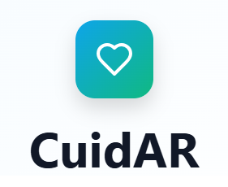

🤝CuidAr
Plataforma que conecta familias con trabajadores/as del cuidado en Olavarría

🌐 CuidAr es una aplicación web que conecta cuidadores/as con familias que necesitan servicios de cuidado en la ciudad de Olavarría, facilitando la búsqueda, contratación y gestión de estos servicios de forma confiable, accesible y segura.

🩹Objetivo del Proyecto

Brindar una solución digital para la gestión de servicios de cuidado, permitiendo a las familias encontrar cuidadores/as según sus necesidades y a los profesionales ofrecer sus servicios con mayor visibilidad.

💻Equipo de trabajo

- Maia Hiese  
- Yazmin Villalba  
- Mari Esteberena  
- Romina Botana

🗂️Documentación del Proyecto

Toda la documentación del proyecto, incluyendo especificaciones, diagramas, planificación, épicas e historias, se encuentra disponible en la siguiente carpeta de Google Drive:

📁Carpeta de Documentación - Proyecto 
CuidAr (https://drive.google.com/drive/folders/1bXD_jtYlJaYIopFeG1PJpgoLuDDalNpC)

✍Funcionalidades principales

- Registro e inicio de sesión con roles ( cuidador/a, familia)
- Perfiles de cuidadores/as
- Solicitudes de cuidado
- Búsqueda y contacto directo - filtros por disponibilidad/ especialidad
- Reseñas y calificaciones
- Panel de administración
- Panel notificaciones

✅Organización y Herramientas

- Gestión de tareas y épicas: Trello (https://trello.com/b/ZNj5aHQ2/desarrollo-app-cuidar)
- Diseño de interfaz: Figma (https://www.figma.com/design/n7fBJWgbYiDpd4pc6nI52y/CuidAr-app?node-id=3-2&t=Z0Me0dakAtT6gTNn-0)
- Documentación: Google Drive - Docs (https://drive.google.com/drive/folders/1bXD_jtYlJaYIopFeG1PJpgoLuDDalNpC)
- Repositorio: GitHub (https://github.com/Yazvillalba/CuidAR)

🎨Diseño

Paleta de colores que transmite profesionalismo, cuidado y calidez:
- Azul y Verde (transmiten bienestar/salud y confianza)
- Fondo Blanco, estilo limpio y moderno
- En caso de necesitar agregar algún color extra: transición Naranja-amarillo (transmite energía, cercanía)

⌛Estado del Proyecto

- [x] Idea general y funcionalidades documentadas  
- [x] Alcance y fuera de scope definidos  
- [x] Especificaciones técnicas preliminares  
- [x] Trello configurando con épicas e historias  
- [x] Diseño de pantallas en proceso (Figma)  
- [ ] Desarrollo frontend y backend (en proceso)

Fuera del Scope: 
- Pagos y transacciones dentro de la plataforma
- Validación legal o certificación de cuidadores/as (si bien intentaremos que exista la posibilidad de adjuntar certificaciones de estudios, será a través del usuario administrador y no mediante conexión con bases de datos de los organismos que emiten títulos, por ejemplo)
- Soporte multilingüe: La plataforma solo estará disponible en español, sin soporte para otros idiomas.
- Sistema de mensajería interna en tiempo real: No se incluye un chat en tiempo real entre usuarios, solo contacto directo a través de los datos proporcionados.
- Automatización de notificaciones por SMS o WhatsApp: Las notificaciones automáticas por SMS o WhatsApp no están incluidas, solo notificaciones dentro de la plataforma.
Integración con sistemas externos de salud o seguros:
- No se prevé la integración con sistemas de salud, seguros médicos o bases de datos externas.
- No se prevé la geolocalización de usuarios para esta versión (para conectar solicitudes y ofertas por cercanía). 